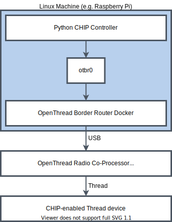

# Configuring Thread network on a Linux machine

In order to use a CHIP controller such as
[Python CHIP Controller](../../src/controller/python/README.md) to control
CHIP-enabled Thread devices from a Linux host, the host must be equipped with a
Thread radio device, a new Thread network must be created and packets addressed
to devices within the network must be routed via the radio device. The article
describes how to achieve that on a Linux machine with Ubuntu 20.04 or later,
using
[nRF52840 Dongle](https://www.nordicsemi.com/Software-and-tools/Development-Kits/nRF52840-Dongle)
as the radio device.

-   [Overview](#overview)
-   [Preparing OpenThread Radio Co-Processor device](#preparing-openthread-radio-co-processor)
-   [Configuring OpenThread Border Router](#configuring-openthread-border-router)
-   [Testing](#testing)

## Overview

The goal of the article is to prepare a setup presented in the diagram below:

Connectivity between Python CHIP Controller and Thread devices is assured in the
following way:

-   CHIP messages generated by the CHIP controller are routed via a virtual
    network interface **otbr0** to
    [OpenThread Border Router container](https://openthread.io/guides/border-router/docker)
    in Docker.
-   OpenThread Border Router container uses a device with
    [OpenThread Radio Co-Processor](https://openthread.io/platforms/co-processor)
    firmware to transmit CHIP messages to the Thread network.
-   CHIP-enabled Thread devices connected to the same Thread network receive and
    consume CHIP messages.

The goal will be achieved by completing the following two steps:

1.  Preparing OpenThread Radio Co-Processor (RCP) device.
2.  Configuring OpenThread Border Router container in Docker.

Note that if you're using a Raspberry Pi as your testing platform, you can
execute the first step (building and programming the RCP firmware) on a more
powerful Linux machine to shorten the firmware build time.

## Configuring OpenThread Radio Co-Processor

A variety of development boards from different vendors can be used as a base for
OpenThread Radio Co-processor firmware.

Read
[Configuring OpenThread Radio Co-processor on nRF52840 Dongle](openthread_rcp_nrf_dongle.md)
to learn how to use Nordic Semiconductor
[nRF52840 Dongle](https://www.nordicsemi.com/Software-and-tools/Development-Kits/nRF52840-Dongle)
for that purpose.

## Configuring OpenThread Border Router

To configure OpenThread Border Router, complete the following steps:

1.  Install Docker daemon:

        $ sudo apt update && sudo apt install docker.io

2.  Make sure that Docker daemon is running:

        $ sudo systemctl start docker

3.  Create an IPv6 network for OpenThread Border Router container in Docker:

        $ sudo docker network create --ipv6 --subnet fd11:db8:1::/64 -o com.docker.network.bridge.name=otbr0 otbr

4.  Start OpenThread Border Router container using the following command. In the
    last line, replace _/dev/ttyACM0_ with the device node name of the nRF52840
    Dongle:

        $ sudo docker run -it --rm --privileged --network otbr -p 8080:80 -e NAT64=0 -e DNS64=0 \
                --sysctl "net.ipv6.conf.all.disable_ipv6=0 net.ipv4.conf.all.forwarding=1 net.ipv6.conf.all.forwarding=1" \
                --volume /dev/ttyACM0:/dev/radio openthread/otbr --radio-url spinel+hdlc+uart:///dev/radio

5.  Open the `http://localhost:8080/` address in a web browser. In case you're
    using a Raspberry Pi without a screen, but you have a different device in
    the same network, you can start a web browser on that device and use the
    address of the Raspberry Pi instead of `localhost`.
6.  Click **Form** in the menu to the left. The network forming creator window
    appears.
7.  Make sure that the On-Mesh Prefix is set to `fd11:22::`. This value is used
    later to configure the IPv6 packet routing.
8.  Click the **Form** button at the bottom of the window to form a new Thread
    network using the default settings.
9.  To ensure that packets addressed to devices in the Thread network are routed
    through OpenThread Border Router container in Docker, run the following
    command:

        $ sudo ip -6 route add fd11:22::/64 dev otbr0 via fd11:db8:1::2

## Testing

After Open Thread Border Router has been configured, use
[Python CHIP Controller README](../../src/controller/python/README.md) to
commission a Thread device into the network and control it using CHIP protocol.
